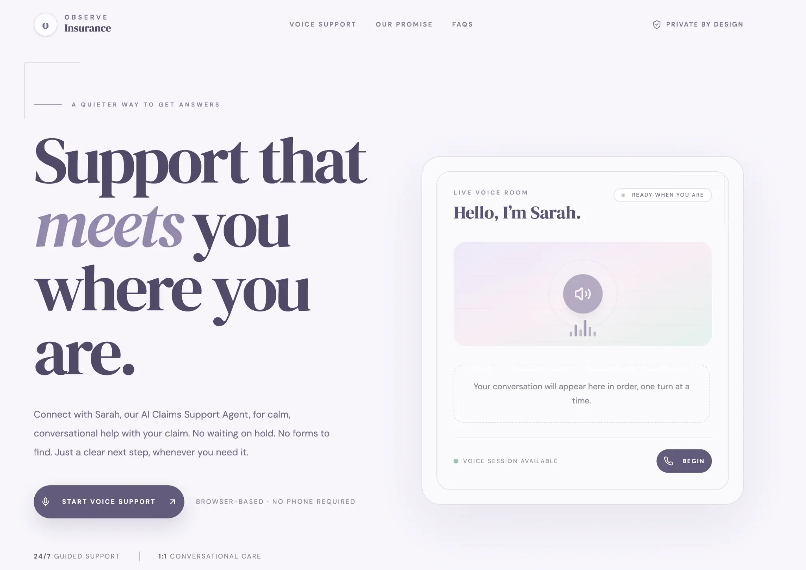
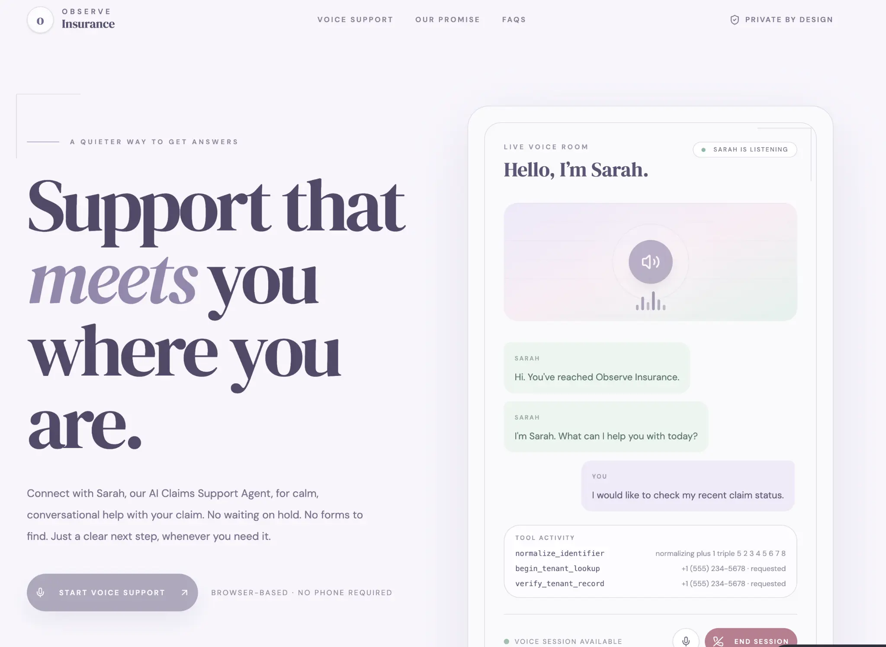
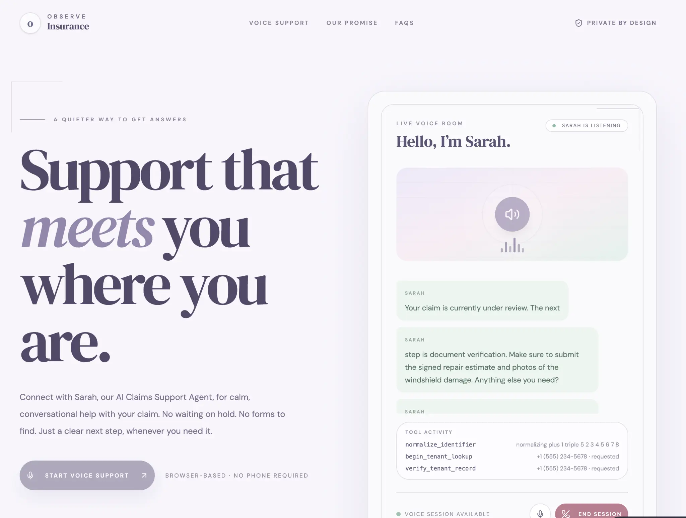

# Observe Insurance Voice Agent

Observe Insurance Voice Agent is a production-oriented voice-support reference application. It demonstrates a customer-service call flow in which a voice agent authenticates a caller, retrieves approved claim information, explains the next action, handles follow-up questions, records a canonical call outcome, and creates a structured handoff when automation cannot complete the request.

The repository is designed as a reusable agent-runtime foundation rather than an insurance-only implementation. Tenant-specific behavior is supplied through configuration, prompts, enabled tools, authentication policy, deployment identity, and provider adapters.

> **Handoff principle:** Vapi owns the audio session, the browser owns presentation of the live session, and the backend owns tenant resolution, tool execution, event auditing, final call outcome, and escalation state.

## Quick start

The fastest local path is:

```bash
npm install
cp .env.example .env   # if .env.example is not already present
# edit .env and set the required values
npm run check
npm test -- --run
./runserver.sh
```

Open the application at [http://localhost:3005](http://localhost:3005). The tenant-admin console is at [http://localhost:3005/admin](http://localhost:3005/admin).

For the local demonstration admin account, use `admin` / `admin`. These credentials are intentionally for the take-home environment only and must be changed before deployment.

## What the application does

Sarah asks for a phone number or customer identifier, normalizes the spoken value, looks up the tenant-scoped customer, requests a date of birth, verifies the caller, retrieves the associated claim, and explains the current status and next action. Once verified, the authenticated context is retained for the remainder of the call so unrelated follow-up questions do not restart verification.

The call remains open when the caller asks a useful follow-up. When the caller clearly says they are finished, Sarah gives the configured goodbye and Vapi ends the call. If the caller becomes silent or an integration stops making progress, the bounded inactivity and timeout policies prevent an indefinite connection.

## Product screenshots and sample run

The following screenshots show the submitted platform surface using the local demonstration build. They contain only fixture data and configuration labels; no production credentials or private customer records are included.

### Product-view gallery

The following snapshots show the product progression from the initial voice-support landing state through an active Sarah conversation and a claim-status response. All examples use synthetic fixture data for demonstration purposes.



*Initial product view: Sarah is available and the caller can begin a browser-based voice session.*



*Active conversation view: transcript turns and backend-driven tool activity are visible together.*



*Claim-status view: Sarah explains the next action while the tool activity panel records the lookup and verification steps.*

### Product walkthrough

The complete product walkthrough is included below as a repository-hosted MP4. Use the controls to play, pause, mute, or expand the demonstration.

<video controls width="100%" preload="metadata" poster="https://raw.githubusercontent.com/sasisprite/observe-insurance-voice-agent/main/docs/screenshots/product-active-conversation.webp">
  <source src="https://raw.githubusercontent.com/sasisprite/observe-insurance-voice-agent/main/docs/assets/check-claim-status-and-upload-documents.mp4" type="video/mp4">
  Your browser does not support embedded video. [Open the MP4 directly](docs/assets/check-claim-status-and-upload-documents.mp4).
</video>
### Representative conversation

The following is the deterministic demo scenario used for end-to-end verification:

```text
Sarah: Hi, you've reached Observe Insurance — I'm Sarah. What can I help you with today?
You: My phone number is plus one, five five five, two three four, five six seven eight.
Sarah: Thanks, Eleanor Vance. Could you please verify your date of birth?
You: My date of birth is November 20, '88.
Sarah: Your claim is currently under review. The next step is to submit the signed repair estimate and photos of the windshield damage.
You: What documents do I need to submit?
Sarah: You need the signed repair estimate and photos of the windshield damage.
You: No, that's all.
Sarah: Thanks for calling Observe Insurance. Have a great day.
[Call ends and the backend finalizes the outcome.]
```

The shortened year is intentionally included in the scenario. The backend normalizes `November 20, '88` to `1988-11-20` before comparing it with the verified fixture record.

### Expected tool activity

The browser-visible tool activity is expected to show the following progression. The backend event ledger receives the corresponding provider and tool events independently.

```text
normalize_identifier
  input: "plus one, five five five, two three four, five six seven eight"
  result: { ok: true, normalizedIdentifier: "+15552345678" }

begin_tenant_lookup
  input: { identifier: "+15552345678" }
  result: { status: "verification_required", customerId: "CUST-10042" }

verify_tenant_record
  input: { identifier: "+15552345678", verificationFactor: "November 20, '88" }
  result: { status: "success", authenticated: true, customerId: "CUST-10042", claimId: "CLM-55412" }

end-of-call-report
  result: { outcome: "completed", customerId: "CUST-10042", claimId: "CLM-55412" }
```

The final outcome is backend-owned. The browser displays live transcript and tool activity, but it does not create the authoritative interaction log.

## Technology stack

| Layer | Technology | Role |
|---|---|---|
| Browser application | React 19, TypeScript, Vite, Tailwind CSS | Live session UI, transcript, tool activity, status, timers, and tenant-admin page. |
| Application server | Node.js, Express, tRPC, TypeScript | Serves the web application and application procedures. |
| Voice provider | Vapi Web SDK and Vapi assistant API | Speech transport, transcription, model turn orchestration, text-to-speech, provider events, and tool calls. |
| Voice backend | Python 3.11, FastAPI, Pydantic | Trusted tenant resolution, tool gateway, webhook handling, event auditing, outcome classification, and handoff metadata. |
| Workflow contract | LangGraph-compatible deterministic state graph | Side-effect-free authentication and escalation routing that can be tested independently of the provider. |
| Persistence | JSON fixtures for local development; MySQL/TiDB through Drizzle and Python SQL adapter for production | Tenant-scoped customers, claims, calls, events, outcomes, handoffs, and agent configuration. |
| Configuration | YAML plus typed TypeScript/Python models | Prompts, tools, voice, transcriber, limits, timeout behavior, tenants, and deployment identity. |
| Observability | Structured event/audit logger and metrics endpoint | Tool latency, errors, circuit state, event counts, call outcomes, and provider events. |
| Development ingress | Cloudflare quick tunnel | Temporary public HTTPS access for Vapi webhooks when the backend is local. |

## Default models and providers

The current default configuration is intentionally explicit and can be changed by tenant configuration or the admin console.

| Component | Default | Purpose |
|---|---|---|
| Agent LLM | `openai/gpt-4o` through the configured Vapi assistant | Conversation reasoning, intent handling, tool selection, and response generation. |
| Backend/config model | `openai/gpt-4o-mini` through the configured OpenRouter setting | Lightweight backend/configuration use where enabled. |
| Speech-to-text | Deepgram `nova-2` | Converts caller speech into text. |
| Text-to-speech | Vapi provider with Savannah voice, version 2 | Produces Sarah’s voice response. |
| Voice provider | Vapi | Current provider adapter implementation. |
| Database | JSON fixture by default locally; MySQL/TiDB when configured | Development fallback versus production persistence. |

The provisioning script registers the assistant copy in Vapi. Editing `config.yaml` or `.env` does not update the already-registered Vapi assistant until `scripts/provisionVapi.mjs` is run again.

## Available tools

| Tool | Use case | One-line behavior |
|---|---|---|
| `normalize_identifier` | Convert spoken phone numbers or customer IDs into canonical lookup values. | Turns phrases such as “plus one, triple five...” into a normalized identifier without letting the model invent formatting. |
| `begin_tenant_lookup` | Find the tenant-scoped customer record. | Returns `verification_required` with the matched customer identity or `not_found` without exposing claim details. |
| `verify_tenant_record` | Authenticate the caller before claim disclosure. | Compares the spoken date of birth with the tenant record and returns approved claim details only after success. |
| Backend event handler | Persist provider and tool lifecycle events. | Records the event ledger and is not exposed as a customer-facing assistant tool. |
| End-of-call finalizer | Produce the canonical outcome. | Classifies completion, failure, timeout, disconnect, escalation, and customer/claim linkage from the provider report. |

Backend-only finalization is deliberately excluded from the live Vapi tool registry. The model can request customer-facing domain tools, but it cannot directly create authoritative interaction logs.

## Workflow map

The runtime flow is:

```text
Caller
  → Vapi voice session
  → Browser session reducer receives transcript/tool events
  → Vapi sends tool request to the public backend URL
  → FastAPI resolves trusted tenant/deployment identity
  → Tool gateway validates, budgets, times out, retries, and executes
  → Repository finds customer and claim data
  → Verification updates authenticated context
  → Vapi continues the conversation with approved facts
  → Vapi sends end-of-call report
  → FastAPI writes one canonical outcome and event ledger entry
  → unresolved outcomes create a handoff case
```

The rendered diagram is available at [`docs/voice-agent-workflow.png`](docs/voice-agent-workflow.png), and the editable source is [`docs/voice-agent-workflow.mmd`](docs/voice-agent-workflow.mmd).

## Repository structure

```text
client/                 React application, voice session UI, admin page, transcript panel
server/                 Node/Express/tRPC procedures and application configuration
backend/app/             FastAPI runtime, tools, policy, repositories, metrics, workflow
backend/providers/       Provider adapter contract, factory, and Vapi implementation
config.yaml              Tenant prompt, tools, model, voice, timeouts, and deployment config
db/                      Drizzle schema and generated SQL migration
scripts/                 Vapi provisioning and diagnostic scripts
docs/                    Architecture diagram source and rendered diagram
runserver.sh             Environment validation and development startup entrypoint
```

## Environment variables

Create `.env` in the repository root. Never commit real secrets.

### Required for a live voice call

| Variable | Required | Description |
|---|---:|---|
| `VITE_VAPI_PUBLIC_KEY` | Yes | Browser-safe Vapi public key used by the Vapi Web SDK. |
| `VITE_VAPI_ASSISTANT_ID` | Yes | Assistant ID printed by `scripts/provisionVapi.mjs`. |
| `VITE_PUBLIC_SERVER_URL` | Yes for browser/server URL discovery | Public HTTPS origin used by the application to reach the backend. |

### Required to provision or update Vapi

| Variable | Required | Description |
|---|---:|---|
| `VAPI_PRIVATE_KEY` | Provisioning only | Server-side Vapi key used by `scripts/provisionVapi.mjs`. Do not expose it to the browser. |
| `PUBLIC_SERVER_URL` | Provisioning only | Public origin used when registering Vapi tool and event URLs. |
| `VAPI_ASSISTANT_ID` | Optional | Existing assistant ID when a deployment chooses explicit update behavior. |

### Production persistence and identity

| Variable | Required | Description |
|---|---:|---|
| `APP_ENV` | Production | Set to `production` to disable development tenant fallback. |
| `DATABASE_URL` | Production | MySQL/TiDB connection string used by SQL-backed repositories. |
| `VOICE_REPOSITORY` | Optional | Set to `sql` to explicitly use SQL; local default may use fixture repositories. |
| `TENANT_DEPLOYMENT_KEY` | Production/provider integration | Trusted deployment identity used to resolve the tenant. |

### Admin control plane

| Variable | Required | Description |
|---|---:|---|
| `ADMIN_USERNAME` | Recommended | Admin username; local demo default is `admin`. |
| `ADMIN_PASSWORD` | Recommended | Admin password; local demo default is `admin`. Change before deployment. |
| `ADMIN_SESSION_SECRET` | Production | Long random secret used to sign admin sessions. |

### Optional integration variables

| Variable | Description |
|---|---|
| `OAUTH_SERVER_URL` | Enables the configured OAuth integration; without it the local app logs a warning and still runs. |
| `OPENROUTER_API_KEY` | Required only if the configured backend OpenRouter path is used. |
| `VITE_ANALYTICS_ENDPOINT` | Optional analytics endpoint. |
| `VITE_ANALYTICS_WEBSITE_ID` | Optional analytics website identifier. |

## Local installation

### Prerequisites

Install Node.js 22 or a compatible current LTS release, npm or pnpm, Python 3.11+, and, for production-style persistence, a reachable MySQL/TiDB instance. Cloudflare is needed only when Vapi must reach a backend running on a local machine.

### Install dependencies

```bash
npm install
python3 -m venv .venv
source .venv/bin/activate
pip install -r backend/requirements.txt
```

The repository also includes the Node lockfile and Python dependency file. Do not install dependencies by hand beyond these files unless troubleshooting a local environment.

### Configure and validate environment

```bash
cp .env.example .env
# edit .env
npm run check
```

If `.env.example` is not present in an older checkout, create `.env` using the environment-variable tables in this README and the existing `.env` template from the delivery package.

### Apply SQL schema for a production-style run

The migration is generated under the Drizzle migration directory. Configure `DATABASE_URL`, then apply it using the repository’s Drizzle workflow:

```bash
npm exec drizzle-kit migrate
```

The local fixture mode does not require MySQL/TiDB and is useful for deterministic interview demonstrations. Production mode must use SQL and should be seeded through a controlled migration or seed process.

### Start the application

```bash
./runserver.sh
```

The script validates the environment and starts the Node application. The application starts the FastAPI voice-agent service according to the project development configuration.

Health endpoints:

```bash
curl http://127.0.0.1:8099/api/health
curl http://localhost:3005/api/health
```

## Cloudflare and Vapi provisioning

Vapi cannot call `localhost` directly. When the backend runs locally, start a temporary tunnel to the public application origin:

```bash
cloudflared tunnel --url http://localhost:3005 --no-autoupdate > /tmp/cloudflared-observe.log 2>&1 &
tail -f /tmp/cloudflared-observe.log
```

Copy the generated `https://...trycloudflare.com` hostname into `VITE_PUBLIC_SERVER_URL` and `PUBLIC_SERVER_URL`, then reprovision Vapi:

```bash
VAPI_PRIVATE_KEY=<server-side-secret> \
PUBLIC_SERVER_URL=https://<current-tunnel>.trycloudflare.com \
node scripts/provisionVapi.mjs
```

After provisioning, save the printed `VITE_VAPI_ASSISTANT_ID` in `.env`, restart the development server, and hard-refresh the browser. The registered Vapi copy contains the current prompt, tools, client event subscriptions, server event URL, and automatic end-call settings.

For a production deployment, replace the quick tunnel with a stable HTTPS hostname, WAF/rate limiting, webhook signature verification, health checks, and a horizontally scalable backend.

## Test customer and expected behavior

The default fixture customer is:

| Field | Value |
|---|---|
| Name | Eleanor Vance |
| Phone | `+1 555 234 5678` |
| Customer ID | `CUST-10042` |
| Date of birth | `November 20, 1988` or `November 20, '88` |
| Claim ID | `CLM-55412` |
| Claim status | Under Review |
| Claim stage | Document Verification |
| Required documents | Signed repair estimate and photos of windshield damage |
| Adjuster | Marcus Brody |

### Happy-path call

Say the following:

```text
“My phone number is plus one, five five five, two three four, five six seven eight.”
“My date of birth is November 20, '88.”
“What is my claim status?”
“What documents do I need to submit?”
“No, that’s all.”
```

Expected results:

| Check | Expected result |
|---|---|
| Identifier normalization | The number maps to `+15552345678`. |
| Customer lookup | Returns Eleanor Vance and `CUST-10042`. |
| DOB parsing | `November 20, '88` becomes `1988-11-20`. |
| Verification | Returns `authenticated: true`. |
| Claim answer | Returns `CLM-55412`, Under Review, and document requirements. |
| Follow-up behavior | The caller can ask a new claim question without repeating verification. |
| Completion | “No, that’s all” triggers goodbye and automatic call termination. |
| UI | Transcript and tool activity are visible in the browser. |
| Backend | End-of-call report produces one canonical outcome with customer and claim linkage. |

### Negative and resilience scenarios

| Scenario | Input or action | Expected result |
|---|---|---|
| Shortened year | “November 20, '88” | Verifies as `1988-11-20`. |
| Invalid DOB | “January 1, 2000” | Authentication fails without claim disclosure. |
| Unreadable DOB | “Sometime in the eighties” | Agent asks once for month, day, and year. |
| Unknown customer | Use an identifier not in fixtures | Returns `not_found` and requests the identifier again; no DOB prompt is issued. |
| Repeat verification | Ask another claim question after successful verification | Agent retains authenticated context and does not call verification again. |
| Follow-up question | Ask for adjuster email after claim status | Agent answers from approved information or states that the information is unavailable; it does not close immediately. |
| Representative request | “I want to speak to a person.” | Creates an escalation/handoff outcome without pushing the caller through the script. |
| Tool outage | Stop the FastAPI service or force a timeout | Bounded retry/circuit policy prevents an indefinite cal| Toutcome records integration failure. |
| Silence | Remain silent beyond the configured inactivity threshold | Agent gives a progress prompt, then a final timeout message, then ends the call. |
| Customer hang-up | End the call from the phone/browser | Provider end event records a normalized disconnect reason. |
| Provider retry | Replay the same event twice | Idempotency prevents duplicate canonical outcome/audit records. |
| Tenant mismatch | Use an invalid deployment key | Backend rejects the request; it does not silently use the insurance tenant in production. |
| Admin login | Open `/admin`, enter `admin` / `admin` | Demo login succeeds; production must replace the credentials. |
| Admin configuration | Change the prompt or enabled tools | SQL-backed environments persist a versioned configuration; fixture mode reports non-durable local state. |

## Automated checks

Run the complete validation suite:

```bash
npm test -- --run
npm run check
npm run build
cd backend
PYTHONPATH=. ../.venv/bin/python -m pytest -q
```

The suite covers normalization, DOB variants, session state, transcript rendering, Vapi tool parsing, admin authentication, tenant/deployment identity, provider adapters, event idempotency, call outcomes, resilience policies, and backend behavior.

## Operational verification

Use the following commands during a deployment or interview demonstration:

```bash
curl -sS http://127.0.0.1:8099/api/health
curl -sS http://127.0.0.1:8099/api/metrics
node scripts/checkPhoneLookup.mjs
node scripts/traceVoiceLogs.mjs
```

A successful end-to-end lookup should show `verification_required` after the phone lookup and `authenticated: true` after the DOB verification. The final provider event should be visible in the backend audit/event output.

## Safety, reliability, and tenant isolation

The model is not the source of truth for customer or claim data. Deterministic backend tools provide approved records after tenant-scoped lookup and identity verification. Tool attempts are bounded, external work is timed, and circuit breakers prevent repeated calls to an unavailable integration.

The backend owns authoritative finalization. The browser displays the call but cannot create the canonical interaction outcome. Every provider event should carry a call correlation key, and production persistence should enforce uniqueness and tenant-scoped foreign keys.

The current local quick tunnel and `admin/admin` account are demonstration conveniences, not production security controls. A market deployment should add stable ingress, provider webhook signature verification, secure secret management, database migrations and backups, PII redaction and retention, observability dashboards, real handoff integration, and production authentication.

## Extending the framework

To onboard another customer, add a tenant configuration containing the organization name, deployment key, first message, system prompt, enabled tools, authentication policy, runtime limits, voice, transcriber, and escalation settings. The generic lifecycle, tool gateway, event ledger, metrics, and provider adapter interfaces remain unchanged.

To onboard another voice provider, implement the provider contract in `backend/providers/base.py`, add a concrete adapter beside `backend/providers/vapi.py`, and register it in `backend/providers/factory.py`. Provider-specific event shapes, tool-call formats, transfer capabilities, and end-call behavior belong inside the adapter rather than in the generic runtime.

## References

The implementation is self-contained in this repository. The principal configuration and runtime references are [`config.yaml`](config.yaml), [`backend/providers/base.py`](backend/providers/base.py), [`backend/providers/vapi.py`](backend/providers/vapi.py), [`backend/app/server.py`](backend/app/server.py), [`backend/app/repository.py`](backend/app/repository.py), [`backend/app/sql_repository.py`](backend/app/sql_repository.py), [`scripts/provisionVapi.mjs`](scripts/provisionVapi.mjs), and [`docs/voice-agent-workflow.mmd`](docs/voice-agent-workflow.mmd).

## Synthetic conversation demo assets

The repository includes a demo-safe, aligned conversation under [`docs/demo-assets/CONVERSATION.md`](docs/demo-assets/CONVERSATION.md). It provides eight separate generated voice clips, one per transcript turn, plus [`conversation.json`](docs/demo-assets/conversation.json) as the machine-readable ordering contract. Sarah uses the `Aoede` voice and the caller uses the `Achird` voice. These recordings are synthetic and contain no real customer audio.

The sequence intentionally includes a phone lookup, a date-of-birth verification using a shortened-year utterance, a claim-status response, and a follow-up question. During the interview, explain that the clips demonstrate the presentation layer only: canonical interaction logging, tenant-scoped identity, tool execution, idempotency, escalation, metrics, and final call outcome remain backend responsibilities.
